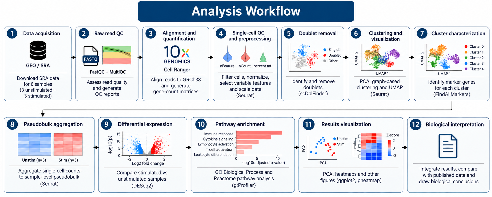
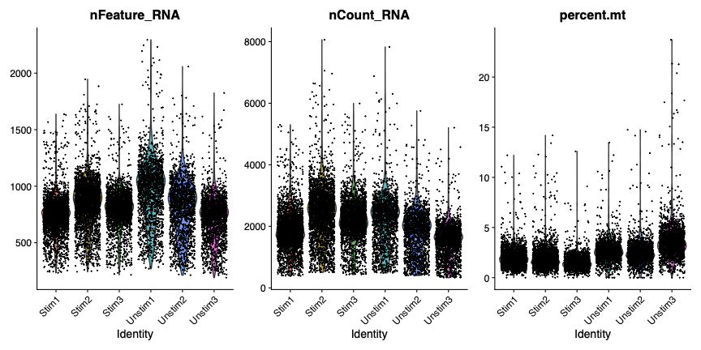
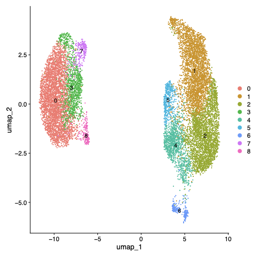
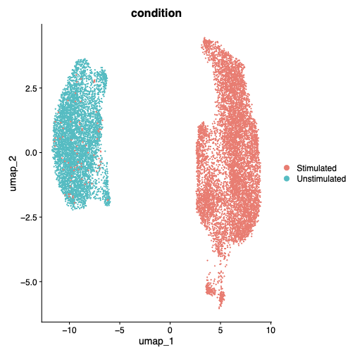
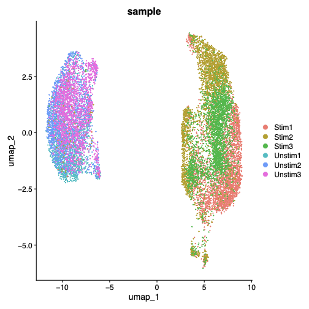
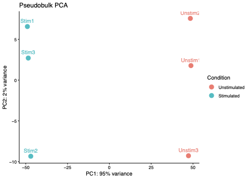
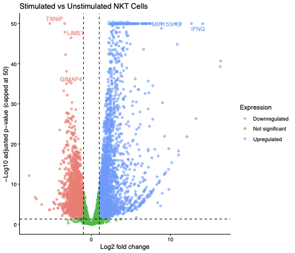
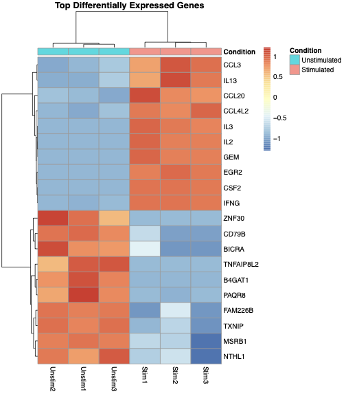

::: {.project-title-details}

<div class="project-name">From Raw Sequencing Data to Biological Interpretation</div>

<div class="project-team">

<div class="project-team-item">
<span class="project-role">Analyst:</span>
<span class="project-person">Archana Allishe</span>
</div>

<div class="project-team-item">
<span class="project-role">Advisors:</span>
<span class="project-person">Daniel Johnson
</div>

<div class="project-team-item project-date">
<span class="project-role">Date</span>
<span class="project-person">October 01, 2026</span>
</div>

</div>

:::

## Project Overview

This project was developed during my time at the Molecular Bioinformatics (mBio) core at UTHSC to gain hands-on experience with single-cell RNA sequencing (scRNA-seq) analysis and strengthen my ability to apply single-cell methods in my current research role. Using the publicly available GSE128243 dataset, I built a reproducible analysis workflow spanning raw sequencing data processing, cell-level quality control and analysis, pseudobulk differential expression, pathway enrichment, and biological interpretation.

# Dataset and Study Design
## Background

Natural killer T (NKT) cells are a specialized population of lymphocytes that share features of conventional T cells and natural killer (NK) cells. Following activation, NKT cells can rapidly produce cytokines and contribute to the regulation of immune responses.

The publicly available **GSE128243** dataset was generated as part of a published study investigating the functional heterogeneity of human peripheral-blood NKT cells (Zhou et al., 2020). In this study, NKT cells were examined under **unstimulated conditions** and following **PMA/ionomycin stimulation**. PMA activates protein kinase C (PKC) signaling, while ionomycin increases intracellular calcium. Together, they provide a strong activation stimulus that induces intracellular signaling and cytokine production.

Single-cell RNA sequencing (scRNA-seq) was used to characterize these responses at the individual-cell level, allowing transcriptional heterogeneity and distinct activation states to be resolved that may be obscured in bulk RNA-seq.

## Rationale for Dataset Selection

The dataset was selected for several reasons:

**Clear experimental comparison:** unstimulated and stimulated NKT cells provide a well-defined biological contrast.\

**Biological replication:** three samples per condition support sample-level comparisons rather than treating individual cells as independent biological replicates.\

**10x Genomics platform:** the dataset provides practical experience processing Chromium Single Cell 3′ v2 sequencing data.\

**Raw-data availability:** sequencing data are available through the NCBI Sequence Read Archive (SRA), allowing the analysis to begin with raw sequencing reads rather than a preprocessed expression matrix.\

**Interpretable biological response:** acute NKT-cell stimulation provides a useful system for examining transcriptional-state changes, immune activation, and cytokine signaling.\

**Published reference:** previously reported analyses provide a benchmark for comparing the major biological patterns recovered through this independent reanalysis.

# Analysis Workflow & Computational Environment

{#fig-analysis-workflow width=90%}

## Computational Environment

**Computing environment:** UTHSC HPC cluster\
**Operating system:** Ubuntu Linux\
**Version control:** Git and GitHub were used to track analysis scripts, workflow development, and project documentation.

## Computational/ Bioinformatics Tools


| Tool / Technology | Analytical Purpose |
|:---|:---|
| **R** | Statistical computing and downstream single-cell analysis using packages including **Seurat, scDblFinder, and DESeq2** |
| **Python** | Scripting and data processing using **pandas, os, glob, and subprocess** for tabular-data manipulation, file handling, pattern-based file discovery, QC summarization, and execution of command-line tools |
| **SRA Toolkit** | Retrieval and conversion of publicly available sequencing data from the NCBI Sequence Read Archive |
| **FastQC** | Assessment of raw sequencing-read quality and identification of potential technical artifacts |
| **MultiQC** | Integration of per-sample QC metrics into a unified sequencing-quality assessment |
| **Cell Ranger** | Processing of 10x Genomics reads, including barcode and UMI handling, alignment, cell calling, and generation of gene-by-cell count matrices |
| **Seurat** | Cell-level quality control, normalization, highly variable feature selection, dimensionality reduction, graph-based clustering, marker analysis, and visualization |
| **scDblFinder** | Identification and removal of predicted doublets prior to downstream single-cell analysis |
| **DESeq2** | Sample-level pseudobulk differential-expression analysis between stimulated and unstimulated conditions |
| **g:Profiler** | Functional enrichment analysis of differentially expressed genes using biological-process and pathway annotations |
| **Git / GitHub** | Version control, tracking of analysis and workflow development, and documentation of the reproducible project |
| **Quarto** | Integration of methods, results, figures, and biological interpretation into a reproducible scientific report |

# Data Acquisition & Raw Data Preparation

## Raw Data Retrieval

Raw sequencing data for **GSE128243** were retrieved from the NCBI Sequence Read Archive (SRA). The dataset consists of six sequencing runs representing three unstimulated and three PMA/ionomycin-stimulated NKT-cell samples.

The **SRA Toolkit** was used to retrieve the sequencing runs and convert the archived SRA data into FASTQ format. Technical reads were retained during conversion because the 10x Genomics data contain separate index, cell-barcode/UMI, and transcript reads required for downstream processing.


## Raw FASTQ Validation and Preparation

The sequencing data were downloaded from SRA using accession-based filenames. Before downstream analysis, the FASTQ files were organized and validated to ensure that each biological sample contained the expected reads for the **10x Genomics 3′ scRNA-seq v2** library structure.

Each sample contained three FASTQ files:

- **I1:** 8 bp sample index read
- **R1:** 26 bp read containing the cell barcode and UMI
- **R2:** 110 bp transcript read

With six biological samples, the expected dataset was:

```text
6 samples × (I1 + R1 + R2) = 18 FASTQ files
```

### Renaming SRA FASTQ Files

The downloaded FASTQ files initially used their **SRA accession numbers** rather than the biological sample names. Using the sample-to-SRA mapping, the files were renamed so that each FASTQ could be directly associated with its corresponding biological sample.

For example:

```text
SRA accession-based files
        │
        ▼
Sample-to-SRA mapping
        │
        ▼
Unstim1_I1.fastq.gz
Unstim1_R1.fastq.gz
Unstim1_R2.fastq.gz
```

### Post-renaming validation

After renaming, the raw-data directory was checked to confirm that all expected FASTQ files were present. The expected read structure was:

| Read | Length | Information |
|---|---:|---|
| I1 | 8 bp | Sample index |
| R1 | 26 bp | Cell barcode + UMI |
| R2 | 110 bp | Transcript sequence |

### Conclusion {.unlisted}

The raw sequencing data were successfully converted from accession-based organization to a clear biological sample-based structure. The final dataset contained **18 FASTQ files representing six samples, each with I1, R1, and R2 reads**, providing the expected input structure for downstream Cell Ranger processing.

# Raw Read Quality Control

## FastQC

FastQC was used to assess sequencing quality for each FASTQ file, including base quality, sequence length, GC content, adapter content, duplication, and other read-level metrics.

For this 10x scRNA-seq dataset, FastQC was run primarily on the **R2 transcript reads**, which contain the transcript sequences used for alignment and gene quantification.

Overall, the sequencing data were suitable to continue to Cell Ranger. The strongest result was read quality: **all six samples passed the per-base sequence-quality, per-sequence quality-score, and sequence-length checks**.

There was also no significant adapter-content problem: **all six R2 samples passed FastQC's adapter-content check**. Therefore, the FASTQ files were not trimmed before Cell Ranger processing.

Two FastQC results initially appeared concerning but did not justify removing samples. The **per-sequence GC-content test** produced warnings for Stim1, Unstim1, Unstim2, and Unstim3 and failures for Stim2 and Stim3. This test compares the observed GC distribution with the distribution expected by FastQC, so these flags were interpreted together with the other sequencing-quality metrics rather than being treated as automatic evidence of poor sequencing.

All six samples also failed the **sequence-duplication test**. High duplication is not by itself a reason to discard scRNA-seq data because highly expressed transcripts and PCR amplification can generate repeated transcript sequences. The cell barcodes and UMIs used during Cell Ranger processing provide more informative molecule-level assessment for this type of library.


### General Statistics

| Sample | Duplication | GC | Sequences |
|:---|---:|---:|---:|
| **Unstim1** | 73.6% | 45.0% | 121.5M |
| **Unstim2** | 74.9% | 45.0% | 126.5M |
| **Unstim3** | 75.4% | 45.0% | 112.3M |
| **Stim1** | 75.3% | 45.0% | 169.8M |
| **Stim2** | 75.8% | 45.0% | 204.4M |
| **Stim3** | 74.1% | 45.0% | 142.5M |


## MultiQC

The complete MultiQC report containing the FastQC results for all six R2 libraries can be viewed below.

<div class="multiqc-link">

[**Open Interactive Full MultiQC Report**](results/multiqc_report.html){target="_blank"}

</div>


### Conclusion {.unlisted}

The raw-read QC showed strong sequencing quality, the expected read length, and no significant adapter contamination. The GC-content and duplication flags were not sufficient to exclude individual libraries. **All six samples were retained without trimming and advanced to Cell Ranger processing.**

# Cell Ranger Processing

After raw-read QC, the next step was to process the 10x sequencing reads into gene-expression count matrices for downstream single-cell analysis.

Because this dataset was generated using the **10x Genomics Chromium Single Cell 3′ v2 platform**, Cell Ranger was used for this step. **Cell Ranger** is the 10x Genomics analysis pipeline for processing Chromium single-cell sequencing data. For gene-expression data, it uses the cell barcodes and UMIs together with the transcript reads to assign reads to cells, align transcript sequences, count molecules, and generate a gene-by-cell expression matrix.

## FASTQ Naming for Cell Ranger

Before running Cell Ranger, the FASTQ filenames were checked against the Cell Ranger naming convention. Our initial simplified filenames, such as:

```text
Unstim1_R1.fastq.gz
```

were converted to the standard Illumina-style format:

```text
Unstim1_S1_L001_I1_001.fastq.gz
Unstim1_S1_L001_R1_001.fastq.gz
Unstim1_S1_L001_R2_001.fastq.gz
```

Keeping the full naming structure made the sample, lane, and read information explicit and ensured that the FASTQ files could be recognized consistently by Cell Ranger.

The dataset uses **10x 3′ v2 chemistry**, so `SC3Pv2` was specified during processing rather than relying only on automatic chemistry detection.


## Read Alignment and Gene-Expression Count Matrices

Cell Ranger was used to align the transcript reads and generate **gene-by-cell expression count matrices** for each of the six samples.

The analysis was performed using **Cell Ranger 10.1.0** with the 10x Genomics **GRCh38 2024-A** human reference:

```text
refdata-gex-GRCh38-2024-A
```

Because the dataset was generated using the **10x Genomics Chromium Single Cell 3′ v2** platform, `SC3Pv2` chemistry was specified during Cell Ranger processing.

### Cell Ranger Outputs

Cell Ranger generated a separate `outs/` directory for each sample. The following outputs were used in this analysis:

| **Cell Ranger Output** | **Content** | **Use in This Analysis** |
|---|---|---|
| `outs/filtered_feature_bc_matrix/` | Filtered gene-by-cell UMI count matrix | Imported into **Seurat** for cell-level QC and downstream single-cell analysis |
| `outs/metrics_summary.csv` | Summary sequencing and cell-recovery metrics | Used to compare **Cell Ranger QC metrics across the six samples** |
| `outs/web_summary.html` | Interactive Cell Ranger processing and QC summary | Used for visual review of individual sample QC results |

The `filtered_feature_bc_matrix/` directory contains three files:

- `matrix.mtx.gz` — gene-by-cell UMI count matrix
- `features.tsv.gz` — gene and feature identifiers
- `barcodes.tsv.gz` — cell barcode identifiers

Together, these files form the filtered gene-expression matrix used as input for downstream analysis in Seurat.

## Cell Ranger Quality Metrics

Cell Ranger QC metrics were collected from the `metrics_summary.csv` output generated for each of the six samples and summarized below.

| Sample | Estimated Cells | Mean Reads / Cell | Median Genes / Cell | Median UMIs / Cell | Saturation | Transcriptome Mapping | Reads in Cells |
|:---|---:|---:|---:|---:|---:|---:|---:|
| **Unstim1** | 1,783 | 68,131 | 992 | 2,305 | 95.2% | 80.9% | 94.3% |
| **Unstim2** | 1,680 | 75,313 | 841 | 1,887 | 96.3% | 80.1% | 91.6% |
| **Unstim3** | 2,047 | 54,841 | 742 | 1,595 | 95.7% | 81.5% | 94.8% |
| **Stim1** | 3,143 | 54,015 | 750 | 1,828 | 94.3% | 75.9% | 95.6% |
| **Stim2** | 2,881 | 70,949 | 876 | 2,482 | 94.3% | 76.3% | 94.1% |
| **Stim3** | 2,668 | 53,408 | 811 | 2,203 | 93.5% | 76.4% | 95.8% |

The six libraries were consistent enough to carry forward, with no obvious failed sample at this stage.

Estimated cell recovery ranged from **1,680 to 3,143 cells per sample**. Median genes per cell ranged from **742 to 992**, while median UMI counts ranged from **1,595 to 2,482**.

The stimulated samples showed slightly lower confident transcriptome mapping (**75.9–76.4%**) than the unstimulated samples (**80.1–81.5%**). However, the values were highly consistent within each condition and did not indicate an isolated poor-quality library.

The **fraction of reads in cells was high across all six samples (91.6–95.8%)**, indicating that most of the usable reads were associated with called cells.

Sequencing saturation was also very high (**93.5–96.3%**), indicating that the libraries were already deeply sequenced and that substantially more sequencing would likely recover relatively few additional unique molecules.


### Conclusion {.unlisted}

Cell Ranger identified **14,202 cells across the six samples**, and no library showed a QC problem that justified exclusion. All six gene-expression matrices were therefore carried forward.

The next step was to import the Cell Ranger matrices into **Seurat** and examine quality at the individual-cell level before normalization, dimensionality reduction, and clustering.

# Cell-Level Quality Control

## Seurat Data Import and Merging

After Cell Ranger processing, the six gene-expression matrices were imported into **Seurat** for cell-level quality control and downstream analysis.

**Seurat** is an R package for the analysis and exploration of single-cell sequencing data. Cell Ranger generated the gene-by-cell count matrices from the raw 10x sequencing reads, while Seurat provided the framework for examining individual cells and carrying the data forward through QC, normalization, dimensionality reduction, clustering, and downstream analysis.

For each sample, the Cell Ranger `filtered_feature_bc_matrix` was loaded into Seurat. The six samples were then merged into a single object while retaining both the sample identity and experimental condition of each cell.

Because the analysis started from Cell Ranger's filtered matrices, the imported barcodes had already undergone Cell Ranger cell calling. The goal at this stage was therefore to examine these cells before applying additional cell-level QC thresholds.

A total of **14,202 cells** across the six samples were available before additional filtering.


## Examining Cell-Level QC

Before filtering, three QC measurements were compared across **Stim1–3 and Unstim1–3**.

**Detected genes (`nFeature_RNA`):** the number of different genes detected in each cell. Most cells contained several hundred to approximately 1,500 detected genes, although some extended above 2,000. Very low values can indicate low-complexity cells, while unusually high values can sometimes indicate droplets containing more than one cell.\

**RNA counts (`nCount_RNA`):** the total UMI count for each cell and a measure of the amount of captured RNA. The six samples showed broadly overlapping distributions, with some expected sample-to-sample variation.\

**Mitochondrial RNA (`percent.mt`):** the percentage of transcripts derived from mitochondrial genes. Most cells were concentrated at relatively low mitochondrial percentages, with a smaller number of high-mitochondrial outliers, particularly in Unstim3.

The QC distributions were broadly comparable across the six samples, with no obvious sample-wide failure. Instead, the plot showed a relatively small number of cell-level outliers that could be addressed through additional filtering.


{#fig-seurat-qc width=100%}

## Evaluating Cell-Level QC Cutoffs

Before applying the QC filters, the effect of each proposed cutoff was calculated separately for all six samples. This allowed the thresholds to be evaluated against the observed data before cells were removed.

The cutoffs evaluated were:

**Detected genes:** `200–2,000` genes per cell\
**Mitochondrial RNA:** `<10%`


| Sample | Total Cells | Genes <200 | Genes >2,000 | MT ≥10% | Removed | Kept |
|:---|---:|---:|---:|---:|---:|---:|
| **Unstim1** | 1,783 | 0 | 11 | 6 | 17 | 1,766 |
| **Unstim2** | 1,680 | 0 | 1 | 7 | 8 | 1,672 |
| **Unstim3** | 2,047 | 1 | 0 | 23 | 24 | 2,023 |
| **Stim1** | 3,143 | 0 | 0 | 5 | 5 | 3,138 |
| **Stim2** | 2,881 | 0 | 0 | 10 | 10 | 2,871 |
| **Stim3** | 2,668 | 0 | 0 | 1 | 1 | 2,667 |
| **Total** | **14,202** | **1** | **12** | **52** | **65** | **14,137** |

The proposed thresholds affected only a small fraction of the dataset. Of the **14,202 cells**, only **65 cells (0.46%)** failed one or more of the criteria, leaving **14,137 cells (99.54%)**.

Only one cell had fewer than 200 detected genes. This was consistent with starting from Cell Ranger's `filtered_feature_bc_matrix`, rather than the raw barcode matrix, because Cell Ranger had already performed cell calling.

The QC distributions and cutoff summary therefore supported applying the evaluated thresholds.


## Applying the QC Cutoffs

Cells were retained when they met all three criteria:

```text
nFeature_RNA >= 200
nFeature_RNA <= 2000
percent.mt < 10
```

The lower gene threshold removes very low-complexity cells, while the upper threshold removes unusually high-complexity profiles that could include multiplets. The mitochondrial threshold removes cells with unusually high mitochondrial transcript content.

After applying the thresholds, the dataset decreased from **14,202 to 14,137 cells**, removing only **65 cells (0.46%)**. Together with the violin-plot distributions, this indicated that the Cell Ranger-filtered dataset was already generally high quality.


## Doublet Detection using scDblFinder

After cell-level filtering, potential doublets were identified before normalization and clustering.

In droplet-based scRNA-seq, a **doublet** occurs when two or more cells are captured under the same barcode and are therefore represented as a single expression profile. These artificial profiles can resemble intermediate or unusual cell states and may influence dimensionality reduction and clustering if they are retained.

Because the six samples were generated as separate 10x libraries, doublet detection was performed **independently for each sample** rather than on the merged dataset as a whole. **scDblFinder** was used to classify cells as predicted singlets or doublets.


| Sample | Cells Before Doublet Removal | Predicted Doublets | Doublet Rate |
|:---|---:|---:|---:|
| **Unstim1** | 1,766 | 80 | 4.5% |
| **Unstim2** | 1,672 | 72 | 4.3% |
| **Unstim3** | 2,023 | 94 | 4.6% |
| **Stim1** | 3,138 | 190 | 6.1% |
| **Stim2** | 2,871 | 163 | 5.7% |
| **Stim3** | 2,667 | 143 | 5.4% |
| **Total** | **14,137** | **742** | **5.2%** |

scDblFinder identified **742 predicted doublets**, corresponding to **5.2%** of the QC-filtered cells. The predicted doublet rate ranged from **4.3% to 6.1%** across the individual libraries.

The stimulated libraries showed somewhat higher predicted doublet rates and also contained more cells than the unstimulated libraries. Importantly, doublets were evaluated within each individual library before the cleaned samples were merged again.

After doublet removal, **13,395 singlet cells** remained for downstream analysis.


### Conclusion {.unlisted}

Cell-level QC showed that the Cell Ranger-filtered matrices were already generally high quality. Gene-count and mitochondrial filtering removed only **65 of 14,202 cells (0.46%)**. Independent doublet detection within each library subsequently identified **742 predicted doublets**.

After both QC steps, **13,395 high-quality singlet cells** remained across all six biological samples.

The singlet dataset was then carried forward to **normalization and identification of highly variable genes**, followed by scaling and principal component analysis (PCA).

# SINGLE-CELL ANALYSIS
After quality control and doublet removal, 13,395 high-quality singlet cells were retained for downstream analysis. The next step was to normalize gene-expression values and identify genes that capture the most informative variation among cells.

## Normalization

The filtered count data were normalized using Seurat's `NormalizeData()` function. Normalization adjusts for differences in total RNA counts between individual cells so that gene-expression values can be compared more meaningfully across the dataset.

Seurat's default log-normalization method was used. Counts within each cell are normalized by the cell's total expression, scaled, and log-transformed.

## Selection of Highly Variable Genes

Not every detected gene is equally informative for distinguishing transcriptional states. Genes with relatively little cell-to-cell variation contribute limited information to dimensionality reduction, whereas genes showing greater biological variability are more useful for identifying differences among cells.

The **2,000 most highly variable genes** were therefore identified using Seurat's variance-stabilizing transformation (`vst`) method. These genes were carried forward for scaling and principal component analysis (PCA).

## Dimensionality Reduction with PCA

After normalization and highly variable gene selection, the next step was to reduce the dimensionality of the dataset and identify the major patterns of transcriptional variation among cells. This involved **scaling the expression data, performing principal component analysis (PCA), and examining the principal components before deciding how many to carry forward**.

### Scaling

The 2,000 highly variable genes were first scaled using Seurat's `ScaleData()`. Scaling centers and scales gene expression so that genes with naturally larger expression values do not disproportionately influence PCA.

### Principal Component Analysis (PCA)

PCA was then performed on the scaled highly variable genes. PCA reduces variation across thousands of genes into a smaller number of **principal components (PCs)** that capture the major patterns of transcriptional variation between cells.

### Selecting Principal Components

Rather than automatically choosing a fixed number of PCs, an **elbow plot** was generated to examine how much variation was captured by successive components.

{#fig-pca-elbow width=75%}

The largest decrease occurred across the first several PCs, followed by a more gradual decline. The curve became noticeably flatter around **PC15–20**, indicating diminishing contributions from later components.

Based on this pattern, the **first 20 PCs** were retained as a reasonable working choice for downstream analysis while preserving sufficient variation to capture the structure of the dataset.

## Cell Clustering and UMAP Visualization

After selecting the first 20 principal components, the next step was to identify groups of cells with similar transcriptional profiles and examine the overall structure of the dataset.

### Cell Neighbor Graph and Clustering

Seurat's `FindNeighbors()` was used to construct a **cell-cell neighbor graph** using PCs 1–20. Cells with similar gene-expression profiles are connected as neighbors in this graph.

Graph-based clustering was then performed using `FindClusters()` at a **resolution of 0.5**. This identified **9 clusters**, numbered 0 through 8.

### UMAP Visualization

To visualize these relationships, **Uniform Manifold Approximation and Projection (UMAP)** was applied using the same 20 PCs. UMAP reduces the multidimensional relationships among cells into two dimensions, allowing cells with similar transcriptional profiles to be viewed together.

{#fig-umap-clusters width=75%}

The UMAP showed a striking overall structure: cells separated into **two major regions**, with the 9 Seurat clusters forming smaller groups within these regions. At this stage, the cause of the large separation was not assumed from the UMAP alone. Because the experiment compares stimulated and unstimulated NKT cells, the next important question was whether the two major regions corresponded to the experimental condition or whether another factor, such as an individual sample, was driving the pattern.

## Experimental Condition and Sample Assessment

The cluster UMAP showed a strong separation between two major groups of cells, with smaller clusters within each group. Because this experiment compares **PMA/ionomycin-stimulated and unstimulated NKT cells**, the next step was to determine whether this large-scale separation corresponded to the experimental condition.

### Distribution by Experimental Condition

The same UMAP was first colored by **stimulation condition**.

{#fig-umap-condition width=75%}

The two major UMAP regions corresponded almost completely to the experimental conditions. **Unstimulated cells occupied one major region, while stimulated cells occupied the other**, showing that stimulation was strongly associated with the dominant transcriptional differences in the dataset. This result indicated that the large separation observed in the cluster UMAP was not simply a collection of unrelated clusters, but was closely associated with the transcriptional response to PMA/ionomycin stimulation.


### Distribution by Individual Sample

Although the condition-level UMAP showed a strong stimulation-associated pattern, it was important to confirm that this separation was supported by all three biological replicates rather than being driven by a single sample. The UMAP was therefore colored by the six individual samples: **Unstim1, Unstim2, Unstim3, Stim1, Stim2, and Stim3**.

{#fig-umap-sample width=75%}

Within the unstimulated population, **Unstim1, Unstim2, and Unstim3 overlapped extensively**. Similarly, the three stimulated samples occupied the stimulated region of the UMAP and showed substantial overlap, although some replicate-specific structure was visible. Importantly, no individual sample formed a completely isolated population. This supported the interpretation that the major separation in the dataset was associated primarily with the experimental stimulation rather than being driven by a single replicate.

### Decision on Sample Integration

Because replicates within each condition showed substantial overlap and no single sample formed an isolated population, the samples were **not automatically integrated or batch-corrected**. The dominant separation corresponded to the experimental stimulation condition, which represents the biological signal of interest. Applying aggressive integration at this stage could reduce some of this stimulation-associated variation.


# CELL-STATE CHARACTERIZATION

## Cluster Marker Gene Analysis Using FindAllMarkers()

Clustering identified **9 transcriptional clusters (0–8)**, but the cluster numbers alone do not explain how the cells differ biologically. Marker-gene analysis was therefore performed to identify genes that were more highly expressed in each cluster relative to the remaining cells.

### Identifying Cluster Marker Genes

Cluster markers were identified using Seurat's `FindAllMarkers()`. For each cluster, cells belonging to that cluster were compared with cells in the remaining clusters.

Only **positive markers** were retained, using the following criteria:

- genes detected in at least **25% of cells in the cluster being evaluated or in the remaining cells**
- minimum **log-fold-change threshold of 0.25**

These criteria focused the analysis on genes that were sufficiently detected and showed increased expression associated with a particular cluster.

The complete marker-gene results for all nine clusters were saved as:

```text
results/cluster_markers.csv
```

This file contains the marker statistics generated for each cluster and was subsequently used to select the strongest cluster-associated genes.

### Top Marker Genes

Because the complete marker analysis produced many genes for each cluster, a smaller set of representative markers was selected.

For each cluster, the genes in `results/cluster_markers.csv` were ranked by their average log2 fold change (`avg_log2FC`). A higher positive value indicates that a gene shows stronger expression in that cluster relative to the remaining cells.

The **10 genes showing the strongest increased expression for each cluster** were selected as the top markers and saved as:

```text
results/top_cluster_markers.csv
```

These top markers provided an initial view of the transcriptional programs represented by each cluster:

| Cluster | Representative Top Marker Genes |
|:---:|---|
| **0** | TXNIP, DUSP1, GIMAP4, GIMAP7, LIME1 |
| **1** | CCL3, CCL4, CCL3L3, TNF, CRTAM |
| **2** | CCL20, DUSP5, GPR183, GADD45A |
| **3** | CD3G, TXNIP, RIPOR2, CCND3 |
| **4** | IL4, IL2, XCL1, XCL2, IFNG, CD40LG, CSF2 |
| **5** | GZMB, KLRD1, GNLY, XCL1, XCL2 |
| **6** | LEF1, ICOS, CD200, GEM |
| **7** | FGFBP2, GZMH, GNLY, KLRD1, NKG7 |
| **8** | CD79A, SELL, LEF1, LTB |

## Cluster Distribution by Experimental Condition

The marker analysis showed distinct transcriptional patterns across the 9 clusters. Because the earlier UMAP also showed strong separation between stimulated and unstimulated cells, the next step was to quantify **how each cluster was distributed between the two experimental conditions**. This helps determine whether the clusters represent populations shared across both conditions or primarily **stimulation-associated transcriptional states**.

### Cluster × Condition Distribution

The number of stimulated and unstimulated cells within each cluster was calculated from the Seurat object.

| Cluster | Stimulated | Unstimulated |
|:---:|---:|---:|
| 0 | 42 | 3,563 |
| 1 | 3,272 | 0 |
| 2 | 2,915 | 0 |
| 3 | 24 | 1,221 |
| 4 | 1,198 | 0 |
| 5 | 471 | 0 |
| 6 | 256 | 0 |
| 7 | 0 | 253 |
| 8 | 2 | 178 |
| **Total** | **8,180** | **5,215** |

The clusters were **strongly condition-specific rather than nine populations shared equally between conditions**. Clusters **1, 2, 4, 5, and 6** contained only stimulated cells, while **cluster 7** contained only unstimulated cells. Clusters **0, 3, and 8** were overwhelmingly unstimulated, with only a small number of stimulated cells. Overall, the final dataset contained **8,180 stimulated and 5,215 unstimulated cells**, for a total of **13,395 cells**.

### Biological Interpretation

Combining the condition distribution with the marker results showed that clustering was capturing **stimulation-associated transcriptional states** very strongly. For example, the entirely stimulated **cluster 4** showed a prominent cytokine-producing program including `IL2`, `IL4`, `IFNG`, `CSF2`, and `CD40LG`. Other stimulated clusters showed different activation or cytotoxic-associated expression patterns, while the unstimulated population contained different baseline and cytotoxic states. For this reason, the 9 clusters were **not treated as nine separate cell types**. The original cluster numbers were retained and interpreted as marker-defined transcriptional states within the NKT-cell population.

### Conclusion {.unlisted}

The strong condition-specific distribution of the clusters shows that stimulation is associated with major changes in NKT-cell transcriptional states. Because each condition contains **three biological replicates**, the cluster distribution was also examined at the individual-sample level to determine how consistently these states were represented across replicates.

## Cluster Composition Across Individual Samples

The condition-level analysis showed that most clusters were strongly associated with either stimulated or unstimulated cells. Because each condition contains **three biological replicates**, cluster composition was examined separately for all six samples to determine how consistently these transcriptional states were represented across replicates.

### Cluster Distribution by Sample

| Cluster | Stim1 | Stim2 | Stim3 | Unstim1 | Unstim2 | Unstim3 |
|:---:|---:|---:|---:|---:|---:|---:|
| 0 | 12 | 26 | 4 | 1,311 | 1,056 | 1,196 |
| 1 | 300 | 1,665 | 1,307 | 0 | 0 | 0 |
| 2 | 2,047 | 137 | 731 | 0 | 0 | 0 |
| 3 | 14 | 7 | 3 | 303 | 474 | 444 |
| 4 | 465 | 364 | 369 | 0 | 0 | 0 |
| 5 | 31 | 380 | 60 | 0 | 0 | 0 |
| 6 | 77 | 129 | 50 | 0 | 0 | 0 |
| 7 | 0 | 0 | 0 | 22 | 15 | 216 |
| 8 | 2 | 0 | 0 | 50 | 55 | 73 |

The major condition-associated states were represented across multiple biological replicates, but their relative abundance varied between samples. The clearest variation occurred in **clusters 1 and 2** among the stimulated samples. In contrast, **cluster 4 was highly consistent**, representing approximately **15.8%, 13.4%, and 14.6%** of Stim1, Stim2, and Stim3, respectively.

Among the unstimulated samples, **clusters 0 and 3 were represented across all three replicates**, whereas **cluster 7 was more abundant in Unstim3**. These differences indicate biological/sample-level heterogeneity in the relative abundance of transcriptional states.


### Conclusion {.unlisted}

The main stimulation-associated transcriptional states were supported by multiple biological replicates, while differences in their relative abundance showed that the replicates were not identical. In particular, the large differences in clusters 1 and 2 among stimulated samples demonstrate why individual cells should not be treated as independent experimental replicates. For the overall **stimulated-versus-unstimulated comparison**, gene counts were therefore summarized at the biological-sample level, preserving the three independent samples in each condition for statistical testing.

# PSEUDOBULK DIFFERENTIAL EXPRESSION
Pseudobulk differential expression combines single-cell counts within each biological sample and compares the resulting sample-level expression profiles between conditions. This preserves the biological replicates and avoids treating individual cells from the same sample as independent replicates.

NOTE: Pseudobulk means combining the single-cell gene counts from all cells belonging to the same biological sample into one sample-level expression profile.

## Pseudobulk Count Matrix

Raw UMI counts from the **13,395 retained cells** were summed gene-by-gene within each of the **six original samples—three stimulated and three unstimulated**. This produced six pseudobulk profiles for the stimulated-versus-unstimulated comparison.

### Aggregating Raw Counts by Sample

Raw RNA counts from the final Seurat object were summed gene-by-gene within each sample using Seurat's `AggregateExpression()`.

The resulting pseudobulk matrix contained **38,606 genes × 6 biological samples**.

| Sample | Total raw UMI counts |
|---|---:|
| Stim1 | 5,302,001 |
| Stim2 | 6,381,099 |
| Stim3 | 5,433,322 |
| Unstim1 | 3,541,753 |
| Unstim2 | 2,785,062 |
| Unstim3 | 2,896,062 |

Each column now represents one biological sample rather than one individual cell. The differences in total counts between samples are retained in the raw matrix and are handled during the downstream differential-expression analysis.

### Conclusion {.unlisted}

Pseudobulk aggregation converted the **13,395-cell dataset into six sample-level expression profiles**, preserving the three biological replicates within each condition. Because many genes have very low counts and contribute little information to statistical testing, the pseudobulk matrix can then be filtered for sufficiently expressed genes and analyzed using **DESeq2** to estimate stimulation-associated changes in gene expression.

## Differential Expression with DESeq2

The pseudobulk count matrix contained one raw gene-count profile for each of the **six biological samples**, preserving the three stimulated and three unstimulated replicates. Differential expression was performed at this sample level using **DESeq2** to identify genes associated with PMA/ionomycin stimulation. DESeq2 models count-based expression data while accounting for differences in library size between samples. The **unstimulated condition was used as the reference**, so positive log2 fold-change values indicate higher expression after stimulation, while negative values indicate lower expression after stimulation.

### Low-Count Gene Filtering

Before differential-expression testing, genes with very low counts were removed because they provide limited information for reliable statistical analysis. Genes were retained if they had **at least 10 counts in at least 3 of the 6 samples**. The requirement for expression in at least three samples corresponds to the number of biological replicates within each experimental condition. This filtering reduced the pseudobulk matrix from **38,606 to 11,487 genes** for differential-expression testing.

### Statistical Comparison
The three stimulated samples were compared with the three unstimulated samples using DESeq2. Genes were considered differentially expressed when they met both of the following criteria:

- **Adjusted p-value < 0.05**
- **|log2 fold change| ≥ 1**

### Differential-Expression Results

Using these criteria, **5,313 genes** were differentially expressed between stimulated and unstimulated samples:

| Direction | Number of genes |
|---|---:|
| Upregulated | 2,843 |
| Downregulated | 2,470 |
| **Total** | **5,313** |

The results showed substantial transcriptional changes following stimulation. `IFNG` was among the strongest upregulated genes, with a log2 fold change of approximately **14.08**. Other prominent upregulated genes included `CD40LG` and `MIR155HG`.

In contrast, `TXNIP` showed a strong decrease after stimulation, with a log2 fold change of approximately **−5.26**. Other downregulated genes included `GIMAP4`, `LIME1`, and `TBC1D10C`.

Several of these genes were also identified during the earlier cluster-marker analysis, providing agreement between the **cell-level transcriptional patterns** and the **sample-level differential-expression results**.

### Conclusion {.unlisted}

Pseudobulk differential-expression analysis identified extensive transcriptional changes associated with stimulation, with **2,843 genes upregulated and 2,470 genes downregulated**. Because differential-expression results describe changes in individual genes, the six pseudobulk samples were subsequently examined by **PCA** to determine whether the overall transcriptome-level variation also separated the stimulated and unstimulated biological replicates.

## Pseudobulk PCA

Differential-expression analysis identified thousands of genes that changed with stimulation. To examine whether this difference was also evident at the **whole-transcriptome level**, principal component analysis (PCA) was performed on the six pseudobulk samples.

For this analysis, the raw counts were transformed using DESeq2's **variance stabilizing transformation (VST)**. VST reduces the dependence of gene-expression variance on count magnitude, making the data more suitable for comparing overall expression patterns between samples. PCA then summarizes the major sources of variation across the six samples and provides a useful check of whether biological replicates behave consistently within each condition.

{#fig-pseudobulk-pca width=75%}

The first principal component (**PC1**) explained **95% of the total variance** and completely separated the three stimulated samples from the three unstimulated samples. **PC2 explained only 2%** of the variance. Importantly, all three biological replicates remained with their respective condition along PC1. Some variation among replicates was visible along PC2, particularly for Stim2 and Unstim3, but this represented only a small fraction of the overall variation. Together, these results show that **stimulation is the dominant source of transcriptome-wide variation** among the six pseudobulk samples.

The pseudobulk PCA independently supported the strong effect of stimulation observed in the single-cell UMAP and differential-expression analysis. More importantly, the separation was reproduced across all three biological replicates in each condition rather than being driven by a single sample. With the sample-level structure established, the magnitude and statistical significance of individual gene-expression changes can be examined together to distinguish the strongest stimulation-associated increases and decreases.

## Volcano Plot

The pseudobulk PCA showed a strong transcriptome-wide separation between stimulated and unstimulated samples. To examine the individual genes underlying this response, the DESeq2 results were visualized using a **volcano plot**. A volcano plot combines two features of differential expression:

- The **x-axis** shows the log2 fold change, indicating the magnitude and direction of the expression change.
- The **y-axis** shows statistical significance as −log10(adjusted p-value).

Genes farther to the right have higher expression after stimulation, while genes farther to the left have lower expression. Genes appearing higher on the plot have stronger statistical evidence for differential expression. The same criteria used in the DESeq2 analysis were applied to the plot: **adjusted p-value < 0.05 and |log2 fold change| ≥ 1**.

{#fig-pseudobulk-volcano width=80%}

The volcano plot showed extensive gene-expression changes in both directions, consistent with the **2,843 upregulated and 2,470 downregulated genes** identified by DESeq2. Because some adjusted p-values were extremely small, −log10(adjusted p-value) was capped at **50 for visualization only**. This prevents a small number of highly significant genes from stretching the y-axis and compressing the majority of points. The original adjusted p-values in the DESeq2 results were not altered.

The volcano plot illustrates the scale of the stimulation response, with a large number of genes showing both substantial effect sizes and strong statistical support. Rather than interpreting these genes individually, it is also useful to examine whether the strongest expression changes show a **consistent pattern across all six biological samples**.

Visualizing the most strongly upregulated and downregulated genes across individual samples provides this additional view of replicate-level expression patterns.

## Differential Expression Heatmap

The volcano plot identified genes with the strongest expression changes between stimulated and unstimulated samples. To examine how these genes behaved across the **six individual biological samples**, the 10 strongest upregulated and 10 strongest downregulated genes were visualized in a heatmap.

The heatmap was generated from **variance-stabilized expression values** rather than raw counts. Expression was then scaled separately for each gene, allowing the relative expression pattern of that gene to be compared across samples.

{#fig-pseudobulk-heatmap width=80%}

The samples separated clearly by experimental condition, with **Unstim1–3 grouping together and Stim1–3 grouping together**. This shows that the strongest differential-expression patterns were reproducible across the biological replicates rather than being driven by a single sample.

Genes including `CCL3`, `IL13`, `CCL20`, `CCL4L2`, `IL3`, `IL2`, `CSF2`, and `IFNG` showed higher relative expression in the stimulated samples. In contrast, genes including `TNFAIP8L2`, `TXNIP`, `MSRB1`, and `NTHL1` showed the opposite pattern. 

The heatmap values represent **gene-wise scaled VST expression (z-scores)**. Therefore, the colors indicate whether a gene has relatively higher or lower expression across these six samples; they do not represent raw counts or log2 fold changes.


The heatmap showed that the strongest stimulation-associated expression changes were **consistent across the biological replicates**, reinforcing the sample-level separation observed by PCA. The differentially expressed genes include many immune- and cytokine-associated genes, but individual gene names do not capture the broader biological processes affected by stimulation. Grouping the significant genes according to their shared functions provides a more interpretable view of the biological response.

# FUNCTIONAL ENRICHMENT ANALYSIS

## g:Profiler Analysis

The pseudobulk differential-expression analysis identified **2,843 upregulated and 2,470 downregulated genes** following stimulation. Because interpreting thousands of genes individually is difficult, functional enrichment analysis was used to determine whether genes changing in the same direction were associated with shared biological processes and pathways.

The upregulated and downregulated gene sets were analyzed separately using **g:Profiler (g:GOSt)**. The analysis included **GO Biological Process** and **Reactome** annotations and used **g:SCS multiple-testing correction** with a significance threshold of **0.05**. The ordered-query option was disabled.

The **11,487 genes retained for pseudobulk differential-expression testing** were used as the custom background. This restricted the enrichment analysis to genes that were eligible for differential-expression testing rather than comparing the significant genes with all genes in the genome.

The analysis was performed using the **g:Profiler web interface** (https://biit.cs.ut.ee/gprofiler/gost), so no local R script was used for this step.

### Enrichment of Upregulated Genes

The genes with increased expression after stimulation showed strong enrichment for immune activation and cytokine-related processes.

| Enriched term | Adjusted p-value | Overlap | Interpretation |
|---|---:|---:|---|
| Immune response | 1.85 × 10⁻¹¹ | 369 | Broad immune-response program |
| Cytokine Signaling in Immune System (Reactome) | 4.03 × 10⁻¹⁰ | 202 | Increased cytokine signaling |
| Lymphocyte activation | 1.49 × 10⁻⁶ | 203 | Activation of lymphocyte programs |
| T cell activation | 8.27 × 10⁻⁶ | 153 | Activation-associated T-cell program |
| Cytokine-mediated signaling pathway | 5.78 × 10⁻⁵ | 121 | Increased cytokine response and communication |

These results are consistent with the expression patterns observed earlier in the analysis. Genes such as `IFNG`, `IL2`, `CSF2`, `CCL3`, and other activation-associated genes showed increased expression after stimulation, while the enrichment analysis demonstrated that these changes collectively represent broader **immune-, cytokine-, and lymphocyte-activation programs**.

### Enrichment of Downregulated Genes

The downregulated gene set showed a more limited enrichment pattern.

| Enriched term | Adjusted p-value | Overlap | Interpretation |
|---|---:|---:|---|
| Small molecule metabolic process (GO:0044281) | 0.0246 | 268 | Changes in genes involved in cellular metabolic processes |

The enrichment of downregulated genes for **small-molecule metabolic processes** suggests that stimulation was accompanied by changes in metabolic gene-expression programs. This result should be interpreted as **metabolic remodeling associated with activation**, rather than evidence that cellular metabolism as a whole was reduced.

### Conclusion {.unlisted}

Functional enrichment connected the differential-expression results to broader biological programs. Genes upregulated after stimulation were strongly enriched for **immune response, cytokine signaling, lymphocyte activation, and T-cell activation**, supporting a coordinated activation response in stimulated NKT cells.

Downregulated genes showed enrichment for **small-molecule metabolic processes**, indicating accompanying changes in metabolic gene-expression programs. Together, these results show that the transcriptional response to stimulation involved both **strong immune activation and metabolic remodeling**.

These findings were then compared with the biological patterns reported in the original **GSE128243 study** to determine whether the major published findings were recovered in this independent reanalysis.

# COMPARISON WITH PUBLISHED FINDINGS

A useful test of an independent reanalysis is not whether it reproduces every cluster or marker exactly, but whether the major biological conclusions remain supported when the data are processed using a different analytical workflow. The original study used GSE128243 to characterize the transcriptional response of human peripheral-blood NKT cells to **PMA/ionomycin stimulation**. The present analysis started from the raw sequencing data and independently reconstructed this response using a modern single-cell and sample-level analysis workflow.

## Convergence of Biological Findings

Several major findings were consistent between the published study and the present reanalysis.

| Biological finding | Published study | Present reanalysis |
|---|---|---|
| **Strong response to stimulation** | Stimulation produced distinct transcriptional states within the NKT-cell population | Stimulated and unstimulated cells showed pronounced separation by UMAP; pseudobulk PCA independently separated all three stimulated from all three unstimulated samples |
| **Cytokine-producing activated states** | Activated NKT cells showed expression of cytokines including IFNG, TNF, IL2, IL4, IL13, and IL10 | Cytokine-producing clusters were observed, including a stimulated state characterized by IL2, IL4, IFNG, CSF2, and CD40LG |
| **Strong IFNG response** | IFNG was associated with activated NKT-cell states | `IFNG` was among the strongest stimulation-associated genes in pseudobulk analysis, with log2FC ≈ 14.1 |
| **Heterogeneous response to activation** | Multiple transcriptionally distinct NKT-cell states emerged following stimulation | Stimulated cells formed several distinct clusters with cytokine, activation, and cytotoxic expression programs |
| **NKT17-related transcriptional program** | IL23R and RORC were detected in stimulated cells | `IL23R` and `RORC` were represented among genes contributing to the T-cell activation enrichment |
| **Metabolic remodeling** | Activation was associated with changes in cellular metabolic programs | Downregulated genes were enriched for small-molecule metabolic processes |

The agreement extends across several independent levels of the analysis. The stimulation-associated structure observed at the **single-cell level** was also evident when expression was aggregated to the **biological-sample level**, and the individual gene changes were supported by **functional enrichment for immune response, cytokine signaling, lymphocyte activation, and T-cell activation**.

Together, these results support the same central biological conclusion: **PMA/ionomycin stimulation induces extensive transcriptional remodeling of human NKT cells, producing distinct activation-associated states characterized by strong cytokine and immune-response programs together with changes in metabolic gene expression.**

## Analytical Differences

Exact reproduction of the original clusters was not expected because the two analyses used different computational approaches.

The published analysis used **Cell Ranger v2.0.1 with hg19, Seurat v2.2.0, CCA, graph-based clustering, t-SNE, and IPA**, with cells filtered using thresholds of fewer than 300 detected genes or greater than 5% mitochondrial content.

The present reanalysis used **Cell Ranger 10.1 with GRCh38, current Seurat methods, scDblFinder for doublet detection, UMAP, and sample-level pseudobulk differential expression with DESeq2**. Cell-level QC retained cells with 200–2,000 detected genes and less than 10% mitochondrial reads.

These differences can affect cell recovery, cluster boundaries, marker rankings, and pathway results. Therefore, agreement was evaluated at the level of **reproducible biological patterns rather than identical computational outputs**.

# Overall Conclusion

This project developed a reproducible single-cell RNA-seq workflow to examine how **PMA/ionomycin stimulation alters the transcriptional states of human peripheral-blood NKT cells** using the publicly available **GSE128243** dataset. Starting from raw sequencing data, the analysis progressed through read-level quality control, Cell Ranger processing, cell-level QC and doublet removal, normalization, dimensionality reduction, clustering, marker analysis, pseudobulk differential expression, and functional enrichment.

## Analysis Summary

Raw sequencing data from **three stimulated and three unstimulated biological samples** were processed with Cell Ranger using the GRCh38 reference. Cell-level QC and doublet removal reduced the initial **14,202 cells to 13,395 high-quality singlets** for downstream analysis.

Analysis of the single-cell expression profiles identified **nine transcriptional clusters**. UMAP revealed a pronounced separation between stimulated and unstimulated cells, and cluster composition showed that several transcriptional states were strongly associated with one experimental condition. Marker analysis further distinguished cytokine-producing, cytotoxic/NK-like, and T-cell-associated expression programs within these states.

Because the biological replication was defined by the six original samples rather than by individual cells, differential expression was performed using a **pseudobulk strategy**. Gene counts were aggregated within each sample and analyzed with DESeq2 using the three stimulated and three unstimulated replicates.

Of **11,487 genes** retained for differential-expression testing, **2,843 were upregulated and 2,470 were downregulated** using adjusted *p* < 0.05 and |log2FC| ≥ 1. Pseudobulk PCA provided independent sample-level support for the magnitude of this response: **PC1 explained 95% of the variance and completely separated the stimulated and unstimulated samples**, while preserving the three biological replicates within their respective conditions.

The differential-expression results showed a strong activation-associated transcriptional response. Genes including `IFNG`, `IL2`, `IL3`, `IL13`, `CSF2`, `CCL3`, `CCL20`, and `CCL4L2` showed increased expression after stimulation, with `IFNG` among the strongest responses (**log2FC ≈ 14.1**). Functional enrichment supported these gene-level observations, identifying **immune response, cytokine signaling, lymphocyte activation, and T-cell activation** among the major processes associated with upregulated genes. Downregulated genes showed enrichment for **small-molecule metabolic processes**, indicating accompanying remodeling of metabolic gene-expression programs.

## Relationship to the Published Study

The independent reanalysis recovered the major biological pattern reported for GSE128243: **strong stimulation-driven transcriptional remodeling of NKT cells accompanied by cytokine and immune-activation programs and changes in metabolic gene expression**.

The analyses were not expected to produce identical computational results. The published study used an earlier **Cell Ranger/hg19 and Seurat v2.2 workflow**, together with different QC criteria, dimensionality-reduction procedures, clustering approaches, and downstream analyses. This project instead used **Cell Ranger 10.1 with GRCh38, current Seurat methods, scDblFinder, UMAP, and sample-level pseudobulk differential expression with DESeq2**.

Consequently, differences in exact cell recovery, cluster structure, marker rankings, and pathway results are expected. More importantly, the central biological response was recovered despite these analytical differences.

## Final Perspective

The stimulation effect was supported at multiple independent levels: **single-cell organization, cluster composition, marker expression, biological-replicate structure, pseudobulk differential expression, and functional enrichment**. The convergence of these results provides strong evidence that stimulation is the dominant source of transcriptional variation in this dataset.

Overall, the project demonstrates an end-to-end and reproducible strategy for moving from **raw single-cell sequencing data to biologically interpretable results**, while preserving the distinction between cell-level exploration and sample-level statistical inference.

# References

1. **Zhou Z, et al.** Single-cell RNA-seq analysis of human NKT cells and their transcriptional response to stimulation. *Frontiers in Cell and Developmental Biology*. 2020;8:384. doi:10.3389/fcell.2020.00384.

2. **Stuart T, Butler A, Hoffman P, et al.** Comprehensive integration of single-cell data. *Cell*. 2019;177(7):1888–1902.e21. doi:10.1016/j.cell.2019.05.031.

3. **Germain P-L, Lun A, Garcia Meixide C, Macnair W, Robinson MD.** Doublet identification in single-cell sequencing data using scDblFinder. *F1000Research*. 2021;10:979. doi:10.12688/f1000research.73600.2.

4. **Love MI, Huber W, Anders S.** Moderated estimation of fold change and dispersion for RNA-seq data with DESeq2. *Genome Biology*. 2014;15:550. doi:10.1186/s13059-014-0550-8.

5. **Raudvere U, Kolberg L, Kuzmin I, et al.** g:Profiler: a web server for functional enrichment analysis and conversions of gene lists (2019 update). *Nucleic Acids Research*. 2019;47(W1):W191–W198. doi:10.1093/nar/gkz369.

6. **10x Genomics.** Cell Ranger: pipelines for processing Chromium single-cell gene-expression data. 10x Genomics software documentation. Version 10.1.
